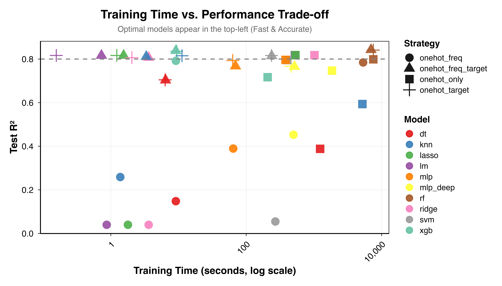
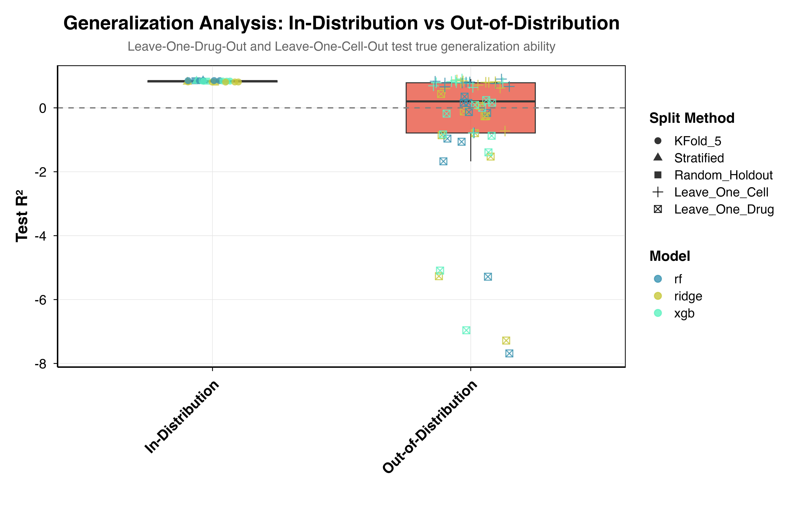

<!-- README.md is generated from README.Rmd. Please edit that file -->

```{r, include = FALSE}
knitr::opts_chunk$set(
    collapse = TRUE,
    comment = "#>",
    fig.path = "man/figures/README-",
    out.width = "100%"
)
```

# GDSCpredictor: Drug Sensitivity Prediction for Cancer Cell Lines

[](https://bio215.shinyapps.io/gdsc_database_and_predictor_215/)
[](https://opensource.org/licenses/MIT)

## Overview

**GDSCpredictor** is a robust R package developed to predict cancer drug sensitivity (IC50) using advanced machine learning models trained on the [Genomics of Drug Sensitivity in Cancer (GDSC)](https://www.cancerrxgene.org/) database. It encapsulates the predictive models derived from our comprehensive [Bioinformatics Pipeline](https://github.com/betheye/GDSCpipeline) and powers the backend of our [Online Shiny Application](https://bio215.shinyapps.io/gdsc_database_and_predictor_215/).

## Key Features

*   **⚡️ High Efficiency**: Default **XGBoost** model (Target-Frequency Encoding) delivers predictions in milliseconds.
*   **🔄 Robust Generalization**: **Ridge Regression** (One-Hot Encoding) optimized for novel drug chemotypes.
*   **🧬 Auto-Encoding**: Built-in pipeline handles Tissue, Cancer Type, MSI Status, and Structure Features automatically.
*   **📦 Batch Processing**: Vectorized operations for analyzing thousands of drug-cell pairs instantly.

## Installation

Install directly from GitHub:

```{r, eval=FALSE}
# install.packages("devtools")
devtools::install_github("XinmiaoWu-xjtlu/GDSCpredictor")
```

## Quick Start

### 1. Load Package
```{r}
library(GDSCpredictor)
```

### 2. Predict Single Case (Default: XGBoost)
```{r}
# Define a cell line - drug pair
input_case <- data.frame(
    Tissue = "breast",
    Sub_Tissue = "breast",
    Cancer_Type = "BRCA",
    MSI_Status = "MSS/MSI-L",
    Drug_Target = "TOP1",
    Target_Pathway = "DNA replication",
    stringsAsFactors = FALSE
)

# Predict IC50 (Natural Log Scale)
result <- predict_single_sensitivity(input_case)
print(result[, c("Predicted_IC50", "Sensitivity_Status")])
```

### 3. Predict for Novel Drugs (Model: Ridge)
```{r}
# Use Ridge Regression when the drug mechanism is unknown/novel
result_ridge <- predict_single_sensitivity(input_case, model = "ridge")
```

---

## 📊 Comprehensive Analysis & Validation

Our package is built upon a systematic benchmark of **10 machine learning models** across **4 encoding strategies** (Total 40 combinations).

### 1. Efficiency vs. Accuracy Trade-off
We selected **XGBoost** as the default model because it occupies the "sweet spot" of the performance landscape. As shown below, it achieves near-optimal accuracy (R² > 0.83) while being orders of magnitude faster than Random Forest.


*Figure 1. Training time vs. Test R² performance. XGBoost (green zone) offers the best balance of speed and accuracy.*

### 2. Prediction Accuracy (XGBoost)
The model demonstrates excellent calibration across the full range of drug sensitivities.


*Figure 2. Predicted vs. Actual LN_IC50 for the XGBoost model. Pearson r = 0.916 indicates strong predictive power.*

### 3. Biological Interpretability (SHAP Analysis)
To ensure our models learn biologically relevant features rather than statistical artifacts, we analyzed feature contributions using SHAP values.
- **Top Predictor**: `Growth.Properties` (Adherent vs Suspension)
- **Pathway Analysis**: Drugs targeting **Mitosis** (red points, negative SHAP) consistently predict higher sensitivity (lower IC50), aligning with clinical efficacy of anti-mitotic agents.


*Figure 3. SHAP summary plot showing top features driving drug sensitivity predictions.*

### 4. Generalization Challenge (LODO Analysis)
Predicting for **novel drugs** (Leave-One-Drug-Out) is significantly harder than standard prediction. While complex models like Random Forest overfit to specific drugs, **Ridge Regression** maintains more robust performance reliability, making it our recommended choice for novel compounds.


*Figure 4. Impact of data splitting strategy on model error (MAE). Ridge Regression minimizes error variance on novel drugs.*

---

## 🧠 Model Portfolio

| Model | Underlying Engine | R² (Test) | Best Use Case | Logic |
|-------|-------------------|-----------|---------------|-------|
| **XGBoost** (Default) | `xgboost` | **0.838** | **Standard Prediction** | uses **Target Encoding** to leverage historical efficacy data. Fast, accurate, ideal for screening known drugs. |
| **Ridge** | `glmnet` | **0.818** | **Novel Discovery** | Uses **One-Hot Encoding** to rely solely on biological mechanisms. Prevents overfitting to specific drug IDs. |

## Citation

If you use this package, please cite our project repository:
[https://github.com/betheye/GDSCpredictor](https://github.com/betheye/GDSCpredictor)

## Authors
- **Xinmiao Wu** (Package Maintainer)
- **Yihan Zhou** (Machine Learning Pipeline)
- **Chonghui Ni** (Web Application)

## License
MIT License
