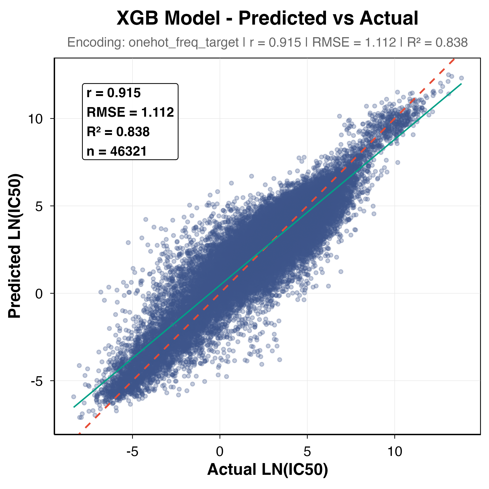

# GDSCpredictor: Drug Sensitivity Prediction for Cancer Cell Lines

## Overview
**GDSCpredictor** is an R package designed to predict the drug sensitivity (IC50) of cancer cell lines based on genomic and molecular features. It encapsulates a pre-trained **XGBoost** model and a robust feature encoding pipeline (One-Hot, Frequency, and Target Encoding) derived from the Genomics of Drug Sensitivity in Cancer (GDSC) dataset.

This package was developed to provide a programmatic interface for the prediction logic used in the companion [Shiny Web Application](https://github.com/your-repo/web-app).

## Features
*   **Pre-trained Model**: Bundled XGBoost model optimized for IC50 prediction.
*   **Automated Encoding**: Handles categorical variable transformation (Tissue, Cancer Type, Target Pathway) automatically.
*   **Dual Modes**:
    *   `predict_single_sensitivity()`: Optimized for single-sample queries.
    *   `predict_batch_sensitivity()`: Efficiently processes large datasets.
*   **Interpretation**: Automatically classifies sensitivity as **High**, **Moderate**, or **Resistant**.

## Installation

You can install the development version of GDSCpredictor from GitHub:

```r
# install.packages("devtools")
devtools::install_github("your-username/GDSCpredictor")
```

Or install locally if you have the source code:

```r
devtools::install("/path/to/GDSCpredictor")
```

## Quick Start

### 1. Load the Package
```r
library(GDSCpredictor)
```

### 2. Prepare Input Data
The model requires a specific set of features. Ensure your data frame contains the following columns:

```r
input_data <- data.frame(
  Tissue = "breast",
  Sub_Tissue = "breast",
  Cancer_Type = "BRCA",
  MSI_Status = "MSS/MSI-L",
  Drug_Target = "TOP1",
  Target_Pathway = "DNA replication",
  stringsAsFactors = FALSE
)
```

### 3. Single Prediction
```r
result <- predict_single_sensitivity(input_data)
print(result[, c("Predicted_IC50", "Sensitivity_Status")])
#   Predicted_IC50 Sensitivity_Status
# 1       1.2345           Moderate
```

### 4. Batch Prediction
```r
# Batch data (example)
batch_data <- rbind(input_data, input_data) 
results <- predict_batch_sensitivity(batch_data)
head(results)
```

## Detailed API

| Function | Description |
| :--- | :--- |
| `predict_single_sensitivity(data)` | Predicts IC50 for a single row. Returns error if >1 row. |
| `predict_batch_sensitivity(data)` | Predicts IC50 for multiple rows. Optimized for batch processing. |
| `encode_features(data)` | Returns the numeric matrix used by XGBoost (useful for debugging or custom modeling). |

## Input Features Dictionary

| Column Name | Description | Example |
| :--- | :--- | :--- |
| `Tissue` | Primary tissue origin | `"lung"`, `"breast"` |
| `Sub_Tissue` | Detailed tissue descriptor | `"lung_NSCLC"` |
| `Cancer_Type` | TCGA Cancer Code | `"LUAD"`, `"BRCA"` |
| `MSI_Status` | Microsatellite Instability | `"MSS/MSI-L"`, `"MSI-H"` |
| `Drug_Target` | Molecular target of the drug | `"EGFR"`, `"TOP1"` |
| `Target_Pathway` | Biological pathway of target | `"EGFR signaling"` |

## Model Selection & Performance

We evaluated multiple machine learning models and selected **XGBoost with One-Hot Frequency Encoding** as the final engine for this application due to its superior accuracy and stability.

### Performance Validation

**1. Prediction Accuracy**
The model demonstrates high accuracy, with predicted IC50 values tightly clustering around the actual values (diagonal line).



**2. Stability (Train vs. Test)**
The model shows low overfitting, with consistent performance across training and testing iterations.


## Authors
*   **Xinmiao Wu** (Package Maintainer & R Development)
*   **Yihan Zhou** (Machine Learning Model)
*   **Chonghui Ni** (Web Application Integration)

## License
MIT
